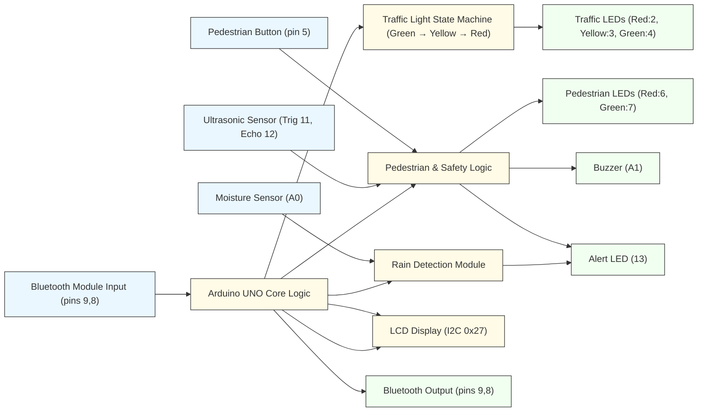

# 🚦 Smart Traffic Light Control System


An **Arduino-based Smart Traffic Management System prototype** integrating **pedestrian control, Bluetooth connectivity, rain detection, obstacle sensing, and jaywalking alerts**. This system simulates a real-world intelligent intersection that responds to **pedestrian requests**, monitors **environmental conditions**, enhances **road safety through sensor-based alerts**, and communicates **real-time traffic status** via an **LCD and Bluetooth module**.


---

## Features

### Traffic Control

* Automatic **traffic light cycling** (Green → Yellow → Red)
* Adaptive **green light duration** based on traffic density (3 levels)
* Fully synchronized **pedestrian walk signal**

### Pedestrian Management

* **Button-triggered crossings** with safety validation
* Ensures **minimum green time** before allowing crossings
* LCD shows **live countdown timer**

### Rain Detection

* Detects rainfall using **moisture sensor**
* Displays and transmits **rain warnings** via Bluetooth and LCD
* **Alert LED** blinks under wet road conditions

### Jaywalking & Collision Alert

* Ultrasonic sensor monitors restricted areas
* Detects **unsafe movement** or **close obstacles**
* Triggers **buzzer and alert LED** for collision warning

### Bluetooth Connectivity

* Communicates with mobile device or terminal
* Sends **system updates and alerts**
* Accepts **manual traffic level input** (`1`, `2`, or `3`)

### LCD Display

* Displays **traffic states, timers, and alerts**
* Shows **startup and system messages**

---

## Hardware Components

| Component                        | Description                                |
| -------------------------------- | ------------------------------------------ |
| **Arduino UNO / Nano**           | Main microcontroller                       |
| **HC-05 / HC-06**                | Bluetooth module                           |
| **HC-SR04**                      | Ultrasonic sensor for jaywalking detection |
| **Rain / Moisture Sensor**       | Detects rainfall                           |
| **16x2 I2C LCD Display**         | Displays system messages                   |
| **LEDs (Red, Yellow, Green)**    | Vehicle signals                            |
| **Pedestrian LEDs (Red, Green)** | Walk/Stop lights                           |
| **Button**                       | Pedestrian crossing request                |
| **Buzzer**                       | Collision alert                            |
| **Resistors, Breadboard, Wires** | Support components                         |

---

## 🪛 Pin Configuration

| Pin | Component                        | Notes                                                                                           |
| --- | -------------------------------- | ----------------------------------------------------------------------------------------------- |
| 2   | Red LED (Traffic)                | digital OUTPUT                                                                                  |
| 3   | Yellow LED (Traffic)             | digital OUTPUT                                                                                  |
| 4   | Green LED (Traffic)              | digital OUTPUT                                                                                  |
| 5   | Pedestrian Button                | INPUT_PULLUP                                                                                    |
| 6   | Pedestrian Red LED               | digital OUTPUT                                                                                  |
| 7   | Pedestrian Green LED             | digital OUTPUT                                                                                  |
| 8   | Bluetooth TX (SoftwareSerial TX) | SoftwareSerial constructor used as `SoftwareSerial(bluetoothRxPin, bluetoothTxPin)` with (9, 8) |
| 9   | Bluetooth RX (SoftwareSerial RX) | See code: `SoftwareSerial bluetooth(9, 8);` (RX=9, TX=8)                                        |
| 11  | Ultrasonic Trigger (HC-SR04)     | digital OUTPUT                                                                                  |
| 12  | Ultrasonic Echo (HC-SR04)        | digital INPUT                                                                                   |
| 13  | Alert LED                        | digital OUTPUT (blinks in rain / steady on hazard)                                              |
| A0  | Moisture Sensor                  | analog input; raining if value < 600                                                            |
| A1  | Buzzer                           | analog/digital output (used as digital HIGH/LOW)                                                |
| I2C | LCD 16x2 (LiquidCrystal_I2C)     | I2C address `0x27`                                                                              |

---

## Software Components

* **Arduino IDE** (v1.8+ or 2.0+)
* **Required Libraries**

  * `SoftwareSerial.h`
  * `Wire.h`
  * `LiquidCrystal_I2C.h`

To install missing libraries, open **Arduino IDE → Tools → Manage Libraries**.

---

## Traffic Logic Overview

| State  | Traffic         | Pedestrian | Duration                  | Description         |
| ------ | --------------- | ---------- | ------------------------- | ------------------- |
| GREEN  | Go              | Stop       | 15–35s (based on traffic) | Normal flow         |
| YELLOW | Prepare to stop | Stop       | 3s                        | Transition phase    |
| RED    | Stop            | Walk       | 3–15s                     | Pedestrian crossing |

---

## 🔗 Serial Commands (Traffic Level Control)

This sketch reads traffic-level commands from the **USB Serial** (Serial Monitor) — **not** from the Bluetooth module.

**Commands (send via Arduino Serial Monitor at 9600 baud):**

* `1` — Low traffic (green = 15 s)
* `2` — Medium traffic (green = 25 s)
* `3` — High traffic (green = 35 s)

> Note: The project prints status and alerts to both the USB Serial and the Bluetooth module (SoftwareSerial) for monitoring, but the current code does not read incoming commands from the Bluetooth module. To accept commands via Bluetooth, read `bluetooth.available()` and parse incoming bytes.

## 📡 Bluetooth Output Examples

The Bluetooth module (pins RX=9, TX=8, 9600 baud) is used for **wireless monitoring** of system status and alerts.
It sends live updates that mirror what’s printed on the Serial Monitor.

### Example messages sent via Bluetooth:

```
Traffic: GREEN | Pedestrians: STOP
WARNING: Pedestrian movement detected
RAIN DETECTED: Caution - wet road conditions
```

### Notes:

* These messages are **output only** in the current implementation.
* The system continuously transmits traffic light states, hazard warnings, and rain alerts.
* To add Bluetooth command control later, implement a `bluetooth.available()` check similar to the existing `Serial.available()` block.

---

## How It Works

1. **Startup**

   * Initializes all sensors and displays.
   * LCD shows “Smart Traffic System Ready”.

2. **Normal Operation**

   * Automatically cycles traffic lights.
   * Pedestrian can press button to request crossing.

3. **Environmental Detection**

   * Rain sensor triggers visual alert.
   * Ultrasonic sensor detects unauthorized crossing or collision risk.

4. **Bluetooth Communication**

   * Sends real-time updates.
   * Accepts manual traffic level control from connected device.

---

## Smart Traffic Control System (Architecture Diagram)



---

## Watch the demo on YouTube

[](https://youtu.be/ZHgoDCEVH1Q)

---

## Future Improvements

* Add **vehicle detection** for automated traffic level adjustment
* Integrate **IoT (ESP32 + Blynk/MQTT)** for remote control
* Enable **data logging** for analytics
* Implement **emergency vehicle prioritization**

---

## Authors

**Albert Prebuji, Abdul Hameed T A, Ashwin Shaju, Abel Ginet, Ashish Shaiju, Muhammed Esa**  
  
*Smart Traffic Control System — 2025*

> Designed for educational and experimental use with Arduino microcontrollers.

---

## License

This project is licensed under the **MIT License** — free to use, modify, and distribute.

---

## Inspiration

This project combines multiple real-world smart traffic system ideas:

* Pedestrian signal synchronization
* Adaptive signal timing
* Rain and hazard detection
* Bluetooth-based monitoring

---
